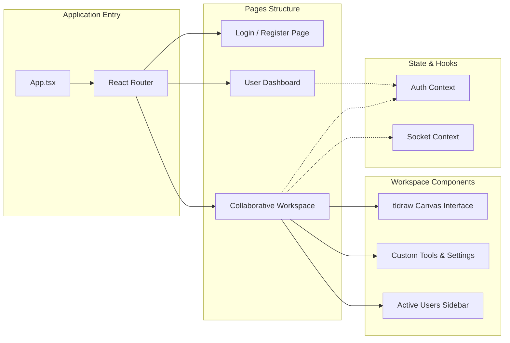

# CollabBoard - Frontend

React + TypeScript frontend for a real-time collaborative whiteboard. Built with tldraw and Socket.io for sub-100ms multi-user drawing sync.

## 📐 Architecture



## 🛠 Tech Stack

[](https://react.dev)
[](https://www.typescriptlang.org)
[](https://vitejs.dev)
[](https://tailwindcss.com)
[](https://socket.io)

React 19 • TypeScript • Vite • tldraw • Socket.io-client • Tailwind CSS v4 • Axios • React Router

## ✨ Features

- Real-time collaborative drawing synced across all participants
- Infinite canvas with zoom/pan via tldraw
- Live cursor presence showing active users
- JWT-based auth with protected routes
- Permission controls — admins can toggle drawing rights per user

## 📡 WebSocket Events

| Event | Direction | Purpose |
| :--- | :--- | :--- |
| `join-room` | Emit | Join a collaborative session |
| `tldraw-changes` | Bidirectional | Sync canvas shape updates |
| `cursor-move` | Bidirectional | Broadcast live cursor positions |
| `user_list` | Listen | Update active participants list |
| `permission-changed` | Listen | Notify drawing permission changes |

## 🚀 Quick Start

```bash
# 1. Clone & install
git clone https://github.com/soham-kolhe/CollabBoard-frontend.git && cd CollabBoard-frontend && npm install

# 2. Configure environment
echo "VITE_BACKEND_URL=http://localhost:5000" > .env

# 3. Run dev server
npm run dev
# → http://localhost:5173
```

> Requires Node.js v18+ and a running [CollabBoard Backend](https://github.com/soham-kolhe/CollabBoard-backend).

## 🔗 Quick Links

- 🔧 [Backend Repository](https://github.com/soham-kolhe/CollabBoard-backend)
- 📦 [Main Project](https://github.com/soham-kolhe/CollabBoard)

---

Created by [Soham Kolhe](https://github.com/soham-kolhe)
